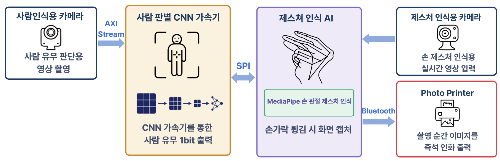
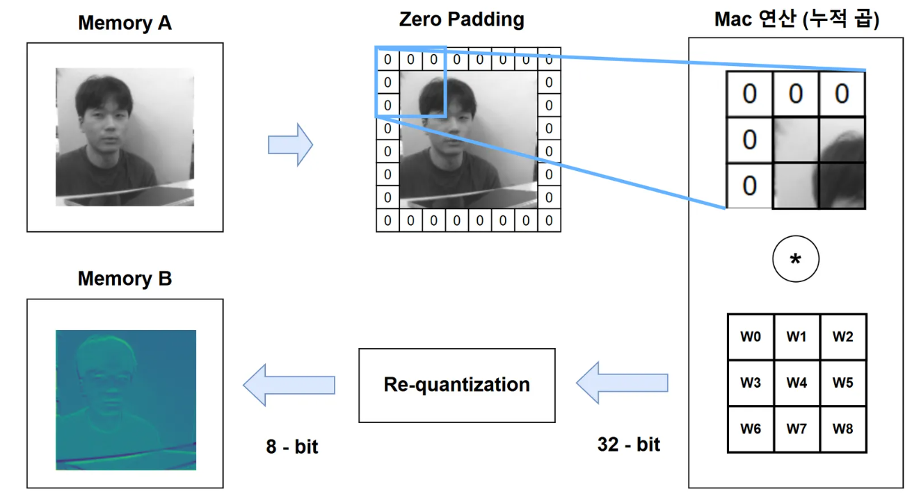
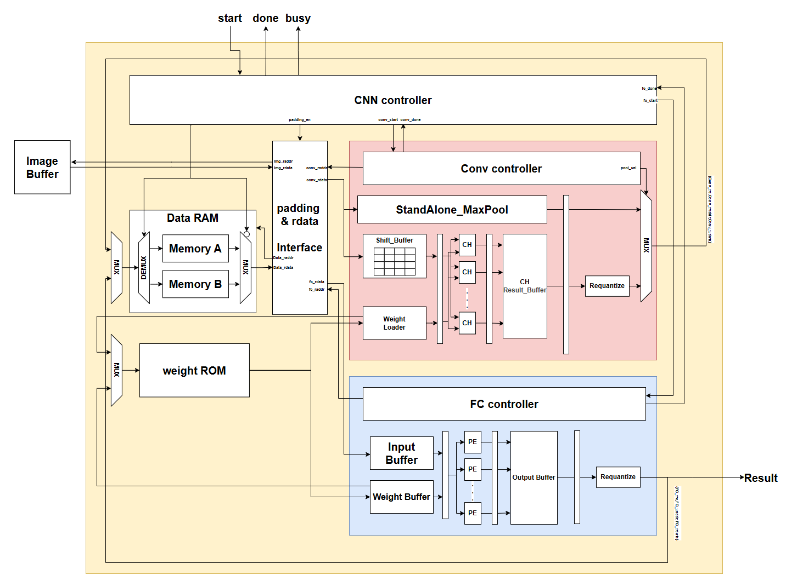
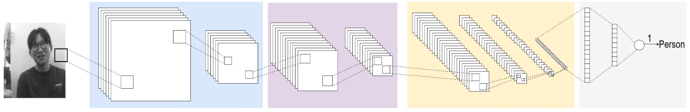
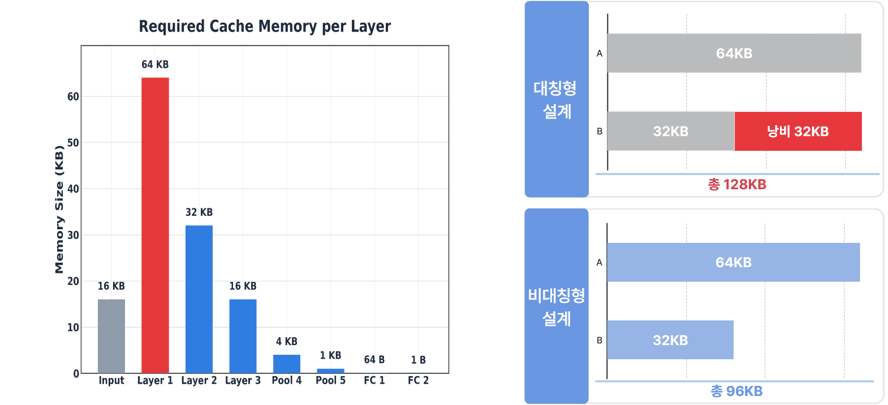
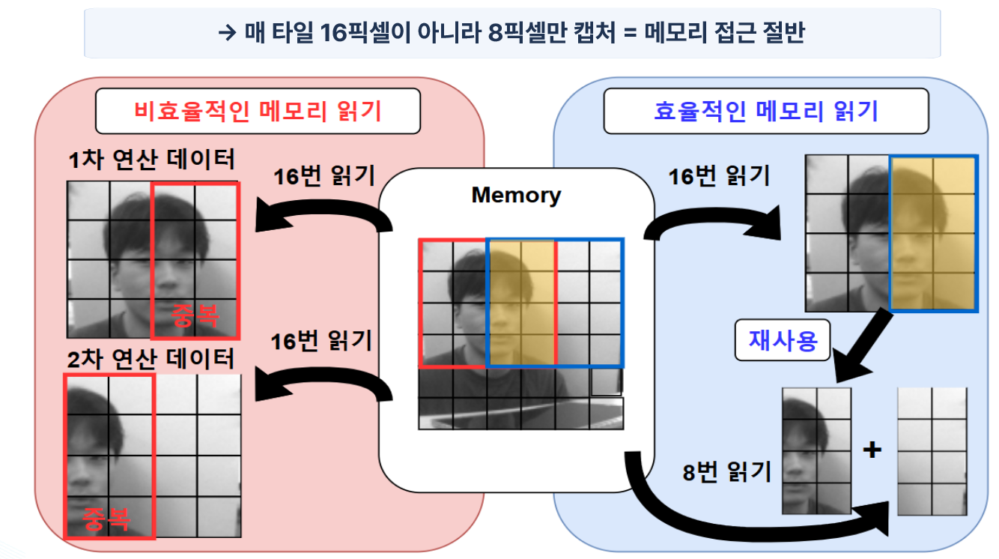
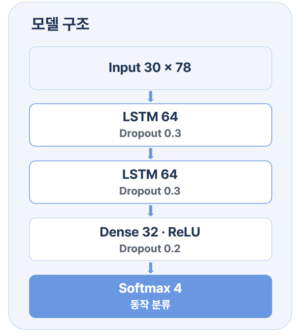
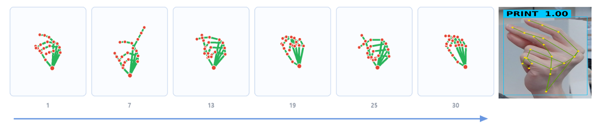
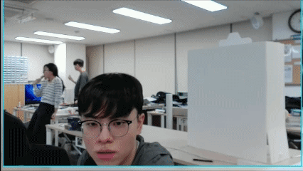
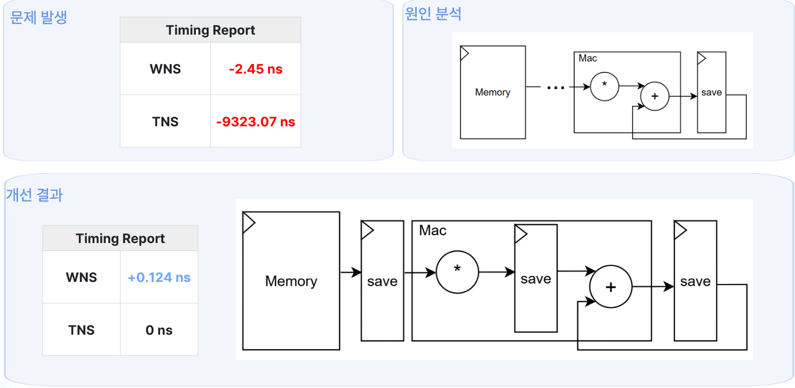

# 📸 저전력 CNN 가속기 기반 비접촉 제스처 사진기 (하나둘셋 찰칵)

  

  
  
  

> **대한상공회의소 서울기술교육센터 프로젝트 (2026.08.20)**  
> 장시간 무인으로 운영되는 포토 키오스크의 고정비(전력 소비 누적) 부담과 터치/리모컨 기기의 파손 위험을 해결하기 위해 개발된 **저전력 & 비접촉 스마트 사진기**입니다.

 

## 👨‍💻 팀원 및 역할 (Team Members)

| 이름 | 역할 | 담당 업무 |
| :--- | :--- | :--- |
| **이준형** | 팀장 | CNN 가속기 통합 |
| **곽은찬** | 팀원 | 인공지능 신경망 최적화 |
| **안정현** | 팀원 | Fully Connected 계층 하드웨어 설계 |
| **윤지원** | 팀원 | Convolution 계층 하드웨어 설계 |
| **최여지** | 팀원 | Pcam 영상 처리 & 이미지 데이터 통신 |
| **최은수** | 팀원/발표 | Z7-20(FPGA)과 Jetson 시스템 통합 및 최적화 |

 

## 📌 주요 특징 (Key Features)

* **상시 사람 감지와 고성능 AI 연산의 역할 분리**
  * **저전력 대기 모드:** 대기 상태에서는 FPGA(Zynq-7000) 내부의 경량 CNN 가속기만 동작하여 사람의 유무를 감지합니다.
  * **동적 전원 관리:** 사람이 인식되었을 때만 고성능 연산 장치(Jetson)를 깨워 제스처 인식을 시작함으로써 전력 소모를 극대화하여 줄입니다.
* **100% 무접촉(Touchless) 제스처 조작**
  * 손가락 튕기기(Snap), 손바닥 펴기(Open) 등의 제스처만으로 화면 캡처부터 즉석 인화까지 완결됩니다.
* **하드웨어 가속기 최적화**
  * 대칭형 Cache 구조의 메모리 낭비를 해결한 **비대칭형 설계** 적용.
  * 인접 타일 재사용을 통해 **메모리 접근 50% 감소**.
  * 곱셈 연산을 **Shift & Add 연산**으로 대체하여 전력 소모 감소 및 타이밍 에러 최소화.

 

## 🛠 시스템 아키텍처 (System Architecture)

  

전체 시스템은 **사람 판별(FPGA)**과 **제스처 인식(Jetson)** 두 파트로 나뉘어 SPI 통신을 통해 핸드셰이크(Handshake) 동작을 수행합니다.

1. **상시 사람 감지 (FPGA - Z7-20)**
   * `Pcam 영상 입력` ➔ `경량 CNN 가속기 추론` ➔ `사람 유무 1-bit 출력` ➔ `SPI를 통해 Jetson으로 신호 전송`
2. **모션 인식 및 제어 (Jetson Orin Nano)**
   * `웹캠 영상 캡처` ➔ `MediaPipe 기반 21개 손 관절 좌표 추출` ➔ `LSTM 기반 4가지 동작 분류` ➔ `사진 촬영` ➔ `블루투스 포토 프린터 인화`
3. **상태 초기화 (Idle)**
   * 제스처(손바닥 Open)를 통해 시스템을 리셋하고, 다시 저전력 CNN 가속기만 동작하는 대기 상태로 진입.

 

## 🧠 딥러닝 모델 구조 (Deep Learning Models)

### 1. 사람 탐지 CNN 가속기 (Person Detection)

  

FPGA(Zynq-7000) 상에서 상시 동작하는 초경량/저전력 하드웨어 가속기입니다. 사람의 유무만을 빠르고 효율적으로 판단하기 위해 모델을 경량화하고 4가지 핵심 하드웨어 최적화 기법을 적용했습니다.

  

* **네트워크 구조 (Network Structure)**
  * **Input:** 128x128 해상도 이미지
  * **Layer:** Conv_1 (16ch) ➔ Pool_1 ➔ Conv_2 (32ch) ➔ Pool_2 ➔ Conv_3 (64ch) ➔ Pool_3~5 ➔ FC & Classifier

  

* **핵심 하드웨어 최적화 기법 (Hardware Optimization)**
  1. **비대칭형 Cache 구조 설계:** 기존 대칭형 캐시 구조에서 발생하는 메모리 낭비(32KB)를 파악하고 비대칭형 구조로 재설계했습니다. 이를 통해 보드 내 한정된 BRAM 공간 제약을 해결했습니다. (총 128KB ➔ 96KB로 사용량 최적화)
     

  2. **인접 타일(Tile) 재사용 및 메모리 대역폭 감소:** 합성곱(Convolution) 연산 특성상 중복되는 메모리 접근을 분석하여 인접 타일 데이터를 재사용하도록 구현했습니다. 매 타일마다 16픽셀을 읽던 방식에서 8픽셀만 캡처하도록 개선하여 **메모리 접근을 절반(50%)으로 감소**시키고 연산 속도를 높였습니다.
     

  3. **곱셈기 제거 (Shift & Add 대체):** 하드웨어 자원(DSP)을 크게 소모하고 타이밍 에러를 유발하는 무거운 곱셈 연산을 **시프트(Shift) 및 덧셈(Add) 연산으로 완전히 대체**했습니다. 지연 시간(Latency) 감소는 물론 Zynq 보드의 전력 소모를 획기적으로 낮췄습니다.
  4. **Requantization (데이터 압축):** 연산 과정을 거치며 누적된 32-bit 크기의 결과값을 8-bit로 재양자화(Requantize)하여 Feature Buffer에 기록(Write)함으로써 데이터 병목 현상을 해소했습니다.

 

### 2. AI 제스처 인식 (Gesture Recognition)

  

  

* **Input:** MediaPipe로 추출한 손 관절 데이터 (30 프레임 시퀀스 x 78차원 특징)
* **Structure:** LSTM (64, Dropout 0.3) ➔ LSTM (64, Dropout 0.3) ➔ Dense (32, ReLU, Dropout 0.2) ➔ Softmax (4 class)

  

 

## 💡 문제 해결 (Troubleshooting)

  

* **TNS (Total Negative Slack) 타이밍 에러 해결**
  * **원인:** 회로 설계상 Critical Path 발생으로 WNS -2.45ns 에러 발생.
  * **해결:** 데이터 경로 최적화를 통해 TNS를 0ns로 맞추고 WNS를 +0.124ns로 개선하여 안정적인 동작(Timing Closure)을 확보.