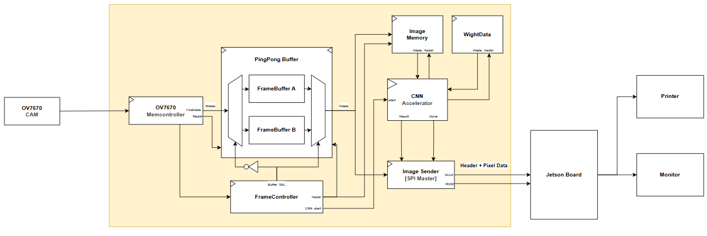

# CNN-Based Gesture Smart Camera

## 개요

이 저장소는 Zybo Z7-20 보드에서 동작하는 int8 CNN 기반 사람/논사람
분류기를 구현합니다. RTL 최상위 모듈은 `CNN_accelerator`이며,
128x128 signed-int8 이미지를 1장 입력받아 CNN 추론을 수행한 뒤
1비트 분류 결과를 출력합니다.

설계는 하나의 물리적 8-lane Convolution 배열(`NUM_CH=8`)을
모든 출력 채널 그룹에서 재사용합니다. 이를 통해 Zynq-7020에서
DSP/로직 자원 사용량을 현실적으로 유지하면서 레이어 처리를 반복형으로 구성했습니다.

## 네트워크 구조

| Stage | 연산 | Feature 크기 | 채널 |
| --- | --- | --- | --- |
| Conv1 | 3x3 Convolution, ReLU, 2x2 MaxPool | 128x128 -> 64x64 | 1 -> 16 |
| Conv2 | 3x3 Convolution, ReLU, 2x2 MaxPool | 64x64 -> 32x32 | 16 -> 32 |
| Conv3 | 3x3 Convolution, ReLU, 2x2 MaxPool | 32x32 -> 16x16 | 32 -> 64 |
| Pool4 | 2x2 MaxPool | 16x16 -> 8x8 | 64 |
| Pool5 | 2x2 MaxPool | 8x8 -> 4x4 | 64 |
| FC1 | Fully Connected + Requantization | 1024 -> 64 | 1024 = 64 x 4 x 4 |
| FC2 | Fully Connected 분류기 | 64 -> 1 | 1 |

64비트 Conv weight word 하나에는 물리적 출력 lane 8개에 대응하는
signed int8 weight 8개가 들어갑니다. FC2의 최종 signed 누적값으로
`result`를 판정합니다.

## RTL 구성

| 모듈 | 역할 |
| --- | --- |
| `CNN_accelerator` | 스케줄러, Conv, FC, padding, ping-pong feature BRAM, weight ROM을 통합합니다. |
| `CNN_acc_controller` | Conv1~3, Pool4~5, FC1, FC2를 스케줄링하며 stage 단위 메모리 선택을 관리합니다. |
| `conv/conv` | 활성 Conv 설정을 선택하고 output group 반복 및 data/weight 인터페이스 브리징을 수행합니다. |
| `conv/Conv_Controller` | output group 1개 기준으로 weight 로드, padding feature 요청, tile 제어, 결과 write 명령을 처리합니다. |
| `conv/Weight_Loader` | input channel/output group 기준으로 커널 9워드와 bias 4워드를 읽습니다. |
| `conv/Shift_Buffer` | 4x4 입력 tile을 캡처하고 겹치는 3x3 윈도우 4개를 출력합니다. |
| `conv/CH`, `conv/CH_wrapper` | signed MAC lane 8개 병렬 처리 블록입니다. `CH`는 3단 product/reduction 파이프라인을 포함합니다. |
| `conv/CH_Result_Buffer` | Conv 결과 벡터 4개를 저장하고 pool/ReLU를 적용한 뒤 feature write를 직렬화합니다. |
| `conv/Standalone_MaxPool` | Pool4, Pool5를 수행합니다. |
| `fc/*` | FC controller, MAC core, output buffer, requantization 경로를 포함합니다. |
| `padding` | tile/row/column 요청을 zero-padding된 이미지/feature-buffer 주소로 변환합니다. |
| `Buffer.sv` | feature용 ping-pong BRAM과 공유 synchronous weight ROM을 제공합니다. |

## 메모리 및 지연(latency) 규약

Feature 데이터는 ping-pong BRAM bank 2개에 저장됩니다.
각 stage는 현재 write bank의 반대 bank를 read하여,
동작 중인 stage가 자신의 입력을 덮어쓰지 않도록 합니다.
Conv와 FC는 top-level read/write mux를 통해 이 메모리를 공유합니다.

Weight 메모리는 synchronous 64비트 ROM입니다.
`weight_mem`은 ROM 접근 전에 선택된 layer의 base address를 더합니다.

중요한 latency 규칙은 다음과 같습니다.

- FC와 Pool4/Pool5는 1-cycle direct feature-BRAM read 동작을 유지합니다.
- Padding Conv read는 `padding` 내부 register 주소와 top-level의 2차 주소 register를 사용합니다.
  반환 데이터는 3-cycle Conv valid 파이프라인과 정렬됩니다.
- 새로운 주소 register를 추가하면, 요청 valid 및 관련 제어 메타데이터에도 동일한 지연을 반드시 맞춰야 합니다.
  주소만 수정해도 분류 점수가 조용히 변할 수 있습니다.

Conv output group 1개 처리 시 컨트롤러는 다음 순서로 동작합니다.
input channel weight 로드 -> 4x4 padded tile read ->
3x3 윈도우 4개 처리 -> 전체 input channel 누적 ->
requantize -> feature write.

## 타이밍 상태

목표 클럭 주기는 8ns입니다.
Padding 주소 계산을 clock 경계 뒤로 이동한 뒤 최신 구현 결과는 다음과 같습니다.

| 지표 | 결과 |
| --- | --- |
| WNS | +0.124 ns |
| TNS | 0 ns |
| Setup 위반 | 0 |

이 수치는 standalone 프로젝트 기준입니다.
더 큰 FPGA 통합 전 권장 여유는 대략 `+0.3 ns` ~ `+0.5 ns`이며,
전체 시스템 라우팅에서 여유가 줄어들 수 있습니다.

## 구현 자원 및 전력

최신 implementation 이후 자원 사용량 및 전력 추정은 다음과 같습니다.

| 자원 | 사용량 | 총량 | 사용률 |
| --- | ---: | ---: | ---: |
| LUT | 10,482 | 53,200 | 19.70% |
| LUTRAM | 8 | 17,400 | 0.05% |
| FF | 9,405 | 106,400 | 8.84% |
| BRAM | 64 | 140 | 45.71% |
| DSP | 13 | 220 | 5.91% |
| IO | 28 | 125 | 22.40% |
| BUFG | 1 | 32 | 3.13% |

| 전력 지표 | 추정치 |
| --- | ---: |
| 총 온칩 전력 | 0.535 W |
| 접합 온도 | 31.2 C |
| 열 여유 | 4.5 W 한계 기준 53.8 C |
| 유효 theta-JA | 11.5 C/W |

전력 추정은 activity 보정 기반이 아닌 implementation 기반이라 신뢰도가 낮습니다.
주요 자원 중 BRAM 제약이 가장 크고, LUT/FF/DSP는 여유가 비교적 충분합니다.

현재 타이밍 개선 관련 변경 사항은 다음과 같습니다.

- 2의 거듭제곱 기반 shift 주소 계산 적용
- Conv weight group base address 사전 계산으로
  Weight Loader 요청 경로의 동적 group-stride 곱셈 제거
- FC 메모리 소유권 register화 및 bias-prefetch 상태 추가로
  FSM->ROM 주소 임계 경로 회피
- Requantization, Conv write metadata, Standalone MaxPool 샘플 파이프라인화
- Padding 주소 register화 및 Conv read-valid 지연 정합

기본 타이밍 대응으로 광범위한 `max_fanout`, `keep`, `dont_touch`
제약을 다시 넣지 마십시오. 이전 실험에서 라우팅이 악화된 사례가 있습니다.
RTL 변경 후에는 반드시 synthesis/implementation을 재실행해야 하며,
이전 리포트는 현재 소스의 근거가 될 수 없습니다.

## 성능 개선 작업

기존 focused 추론은 `9,947,909` cycles가 소요되었습니다.
현재 Conv MAC lane은 product capture -> pair-sum -> final reduction/accumulation
3단 스트리밍 파이프라인으로 구성되어,
result-buffer backpressure가 없는 구간에서는 3x3 윈도우를 cycle당 1개 처리할 수 있습니다.

연속 feature-read 스케줄러 실험에서 추론 시간이 `6,605,573` cycles로 줄었지만,
FC1 feature 값이 바뀌며 `nonperson1` 오분류가 발생해 해당 변경은 되돌렸습니다.
연속 padded request를 안전하게 처리하려면
3-cycle 주소/데이터 연관을 보존하는 명시적 request/response FIFO가 필요합니다.
좌표 준비 버블만 제거하는 방식은 기능적으로 안전하지 않습니다.

남은 Conv 처리량 개선 후보(우선순위 순):

1. latency를 고려한 padded-read request FIFO를 추가해 feature 요청을 cycle당 1회 안전하게 발행
2. Conv weight 이중 버퍼링으로 현재 tile 처리 중 다음 input channel prefetch
3. `CH_Result_Buffer`의 `PREPARE_OUTPUT` 버블 제거 후 연속 write 스트리밍

## 검증

시뮬레이션 소스 위치:
`Lab00_Dram_controller/Dram_controller/Dram_controller.srcs/sim_1`

| 테스트벤치 | 범위 |
| --- | --- |
| `tb_CNN_accelerator_mem.sv` | 집중형 4장 회귀 테스트(사람 2장 + 논사람 2장) |
| `tb_CNN_accelerator_mem_all.sv` | 대규모 사람/논사람 회귀 테스트 |
| `tb_padding_sizes.sv` | 지원 feature-map 크기에 대한 padding/주소 검증 |

Focused 테스트는 메모리 파이프라인 지연을 반영해
`12,000,000` cycle timeout을 사용합니다.
정상 통과 기준은 기대된 4개 판정을 모두 보고하고,
최종 메시지로 `ALL TESTS PASSED (4 cases)`를 출력하는 것입니다.

현재 소스 상태에서는 CH MAC 파이프라인 변경 이후 focused 회귀를 다시 수행해야 합니다.
연속 feature-read 변경은 요청/데이터 정렬 구조를 재설계하고 검증하기 전까지
되돌린 상태를 유지해야 합니다.

