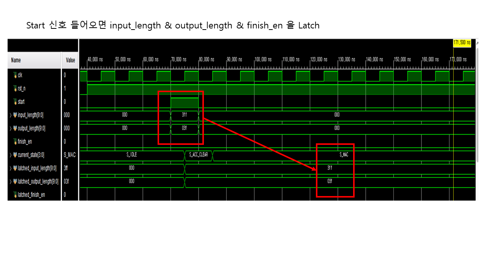
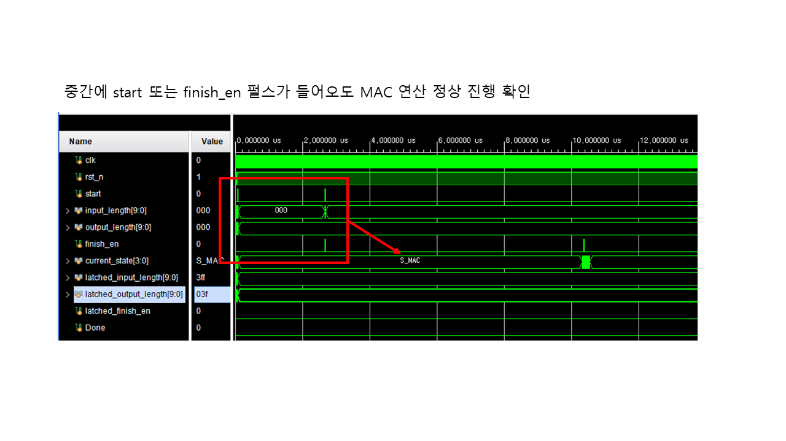
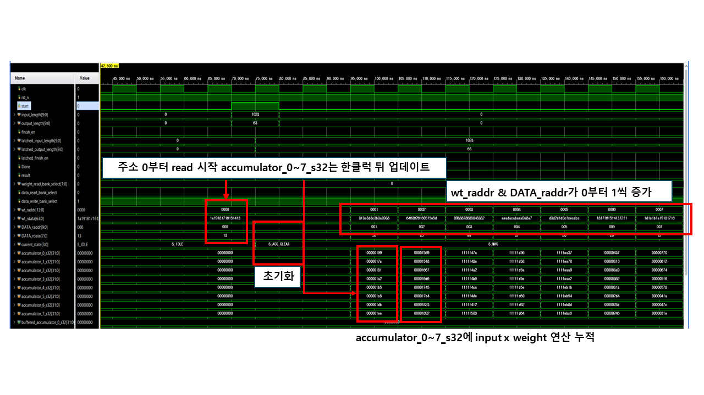
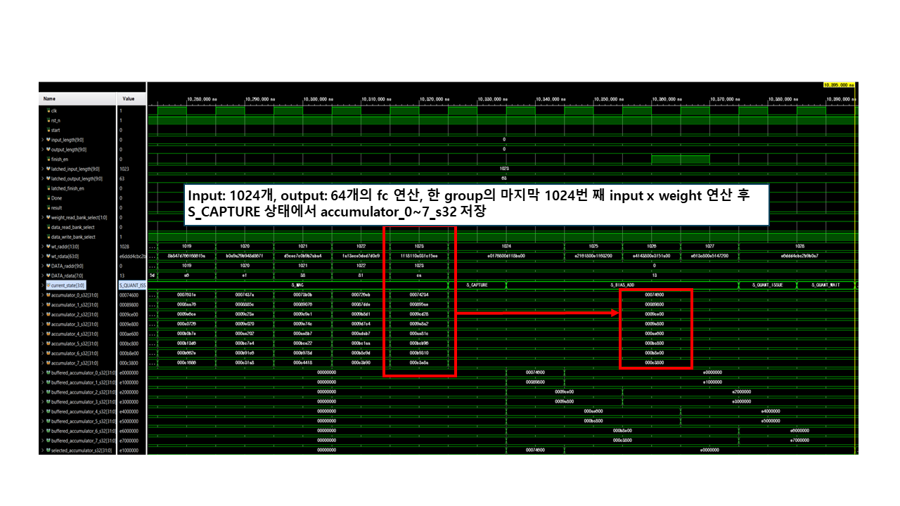
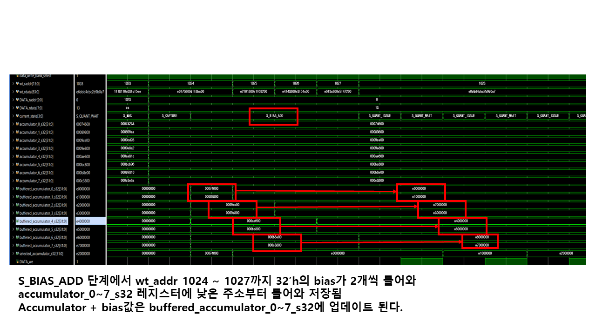
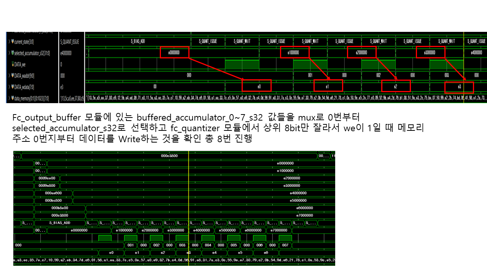
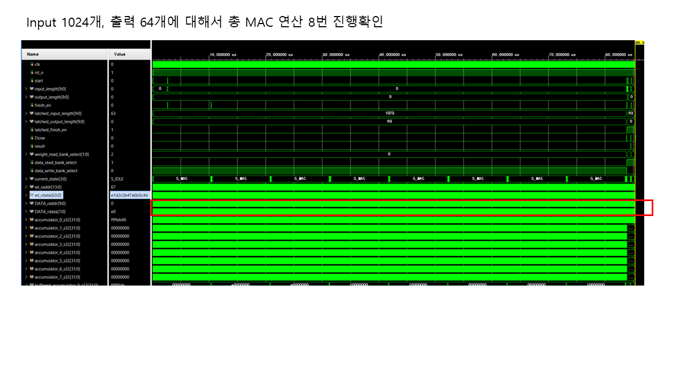
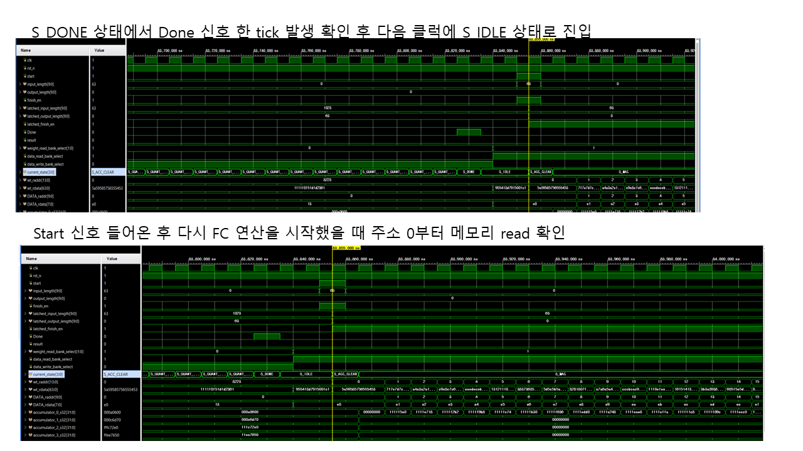
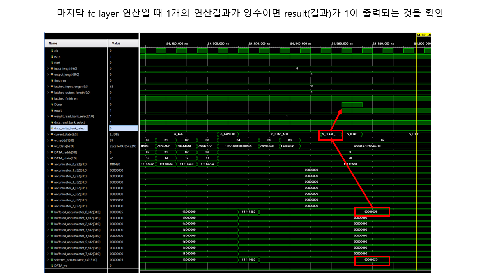
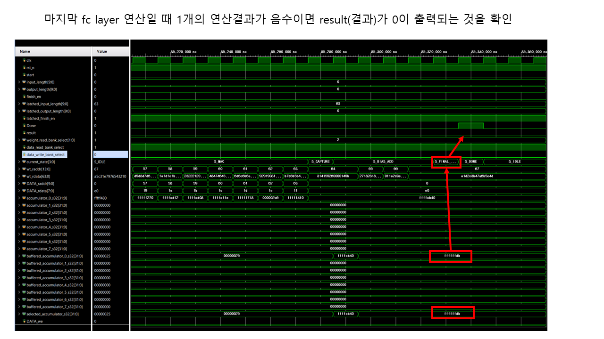

# CNN-Based_Gesture_Smart_Camera

## Block Diagram

## Simulation & Waveform Analysis

FC(Fully Connected) 모듈은 `S_IDLE → S_ACC_CLEAR → S_MAC → S_CAPTURE → S_BIAS_ADD → (S_QUANT_ISSUE ↔ S_QUANT_WAIT) → S_DONE → S_IDLE` 순서의 FSM으로 동작하며, 마지막 레이어에서는 양자화(Quantization) 대신 부호 판정을 수행하는 `S_FINAL` 상태를 거쳐 1비트 `result`를 출력한다. 아래는 이 흐름을 시뮬레이션 파형으로 순서대로 검증한 내용이다.

### 1. Start 신호 입력 및 파라미터 Latch

`start` 신호가 1클럭 동안 인가되면, 그 시점의 `input_length[9:0]`, `output_length[9:0]`, `finish_en` 값이 각각 `latched_input_length`, `latched_output_length`, `latched_finish_en` 레지스터에 래치된다. 위 파형에서는 `input_length = 3ff(1023)`, `output_length = 03f(63)`가 입력된 순간 `current_state`가 `S_IDLE → S_ACC_CLEAR → S_MAC`으로 전이되면서 값이 그대로 래치되는 것을 확인할 수 있다. 즉, 실제 연산에 사용되는 파라미터는 `start` 시점에 고정되어, 연산이 진행되는 동안 입력 포트 값이 바뀌어도 영향을 받지 않는다.

### 2. 연산 중 Start/Finish_en 펄스에 대한 내성 확인

FC 연산이 `S_MAC` 상태로 한창 진행 중일 때 `start` 또는 `finish_en` 펄스가 중간에 다시 들어오는 상황을 시뮬레이션했다. 이 경우에도 `current_state`는 `S_MAC`을 그대로 유지하며 연산 흐름이 끊기지 않는다. 즉, 래치 로직은 `S_IDLE` 상태에서 들어오는 `start`만 유효하게 처리하고, 연산 도중에 들어오는 스퓨리어스(spurious) 펄스는 무시하도록 설계되어 있음을 확인할 수 있다.

### 3. MAC(Multiply-Accumulate) 연산 동작

`S_MAC` 상태에서는 `wt_raddr`, `DATA_raddr`가 0번지부터 1씩 증가하며 가중치(`wt_rdata`)와 입력 데이터(`DATA_rdata`)를 순차적으로 read한다. 두 값을 곱한 결과는 `accumulator_0~7_s32` 8개 레지스터에 누적되는데, 이때 read한 클럭보다 한 클럭 뒤에 누적값이 갱신되는 파이프라인 지연(latency)이 존재한다. 연산 시작 전 `accumulator_0~7_s32`는 모두 0으로 초기화되어 있으며, 이후 매 클럭 input × weight 곱셈 결과가 누적되어 나간다.

### 4. Accumulator Capture (그룹 종료)

Input 1024개, output 64개의 FC 연산에서, 한 그룹의 마지막인 1024번째 input × weight 연산이 끝나면(`wt_raddr`/`DATA_raddr`가 1023에 도달) 상태가 `S_CAPTURE`로 전이된다. 이 상태에서 그동안 누적된 `accumulator_0~7_s32` 값이 다음 단계로 캡처(고정)되어, 이어지는 Bias 더하기 단계에서 사용할 수 있도록 준비된다.

### 5. Bias Add 단계

`S_BIAS_ADD` 상태에서는 `wt_addr` 1024~1027번지에서 32비트 bias 값이 한 클럭에 2개씩(`wt_rdata[63:0]` 상/하위 32비트) 읽혀와 `accumulator_0~7_s32` 8개 레지스터에 낮은 주소부터 순서대로 더해진다. 그 결과(accumulator + bias)는 `buffered_accumulator_0~7_s32` 레지스터에 업데이트되며, 이후 양자화/판정 단계의 입력으로 사용된다.

### 6. Output Quantization & 메모리 Write

`Fc_output_buffer` 모듈은 `buffered_accumulator_0~7_s32` 값을 mux를 통해 0번부터 순서대로 `selected_accumulator_s32`로 선택하고, `fc_quantizer` 모듈에서 이 값의 상위 8비트만 잘라 양자화한다. `DATA_we`가 1일 때 `data_memory`의 0번지부터 순차적으로 write되며, 8개의 accumulator에 대해 총 8번의 write가 반복되는 것을 확인할 수 있다(`S_QUANT_ISSUE` ↔ `S_QUANT_WAIT` 상태 반복).

### 7. 전체 그룹 반복(총 8회) 확인

Input 1024개, output 64개인 FC 레이어는 한 번에 8개의 accumulator만 사용하므로, 위 3~6단계(`S_MAC → S_CAPTURE → S_BIAS_ADD → S_QUANT_ISSUE/WAIT`)가 총 8번 반복되어야 64개의 출력을 모두 만들어낼 수 있다. 전체 파형에서 `S_MAC` 상태가 8회 반복되는 것을 확인함으로써, 64개 출력에 대한 FC 연산이 그룹 단위로 정상적으로 순회하는 것을 검증했다.

### 8. Done 신호 및 재시작(Start) 동작

8개 그룹 연산이 모두 끝나면 `S_DONE` 상태에서 `Done` 신호가 정확히 한 클럭(1 tick) 동안만 펄스로 발생한 뒤, 다음 클럭에 `S_IDLE` 상태로 복귀한다(위쪽 파형). 이후 새로운 `start` 신호가 다시 인가되면, FC 연산이 처음부터 재시작되며 `DATA_raddr`가 다시 0번지부터 메모리를 read하는 것을 확인할 수 있다(아래쪽 파형). 이를 통해 모듈이 한 번의 연산 후에도 정상적으로 초기 상태로 복귀하여 반복 사용 가능함을 검증했다.

### 9. 최종 레이어(Final Layer) 판정 동작

마지막 FC 레이어(출력 1개)의 연산에서는 양자화 대신 `S_FINAL` 상태에서 부호 판정을 수행한다. 위 파형은 최종 연산 결과(`selected_accumulator_s32`)가 양수(`00000025`)인 경우로, `result` 신호가 `1`로 출력되는 것을 확인할 수 있다.

반대로 최종 연산 결과가 음수(`ffffffdb`, 2의 보수 표현)인 경우에는 `result`가 `0`으로 출력된다. 두 파형을 통해 FC 모듈의 마지막 레이어가 별도의 부호 비교 로직으로 이진 판정(binary decision) 결과를 내보내는 동작이 정상적으로 구현되었음을 확인했다.