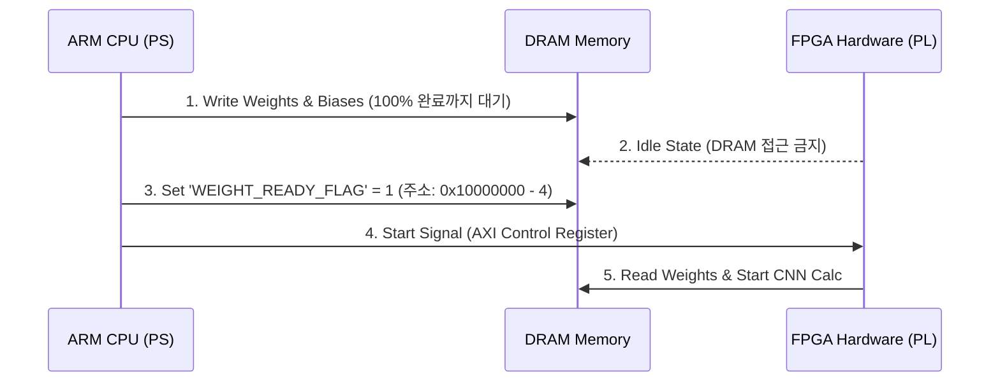

# 02. Zybo DRAM 사전 적재 및 동기화 방지 가이드

본 문서는 Zybo Z7-20 시스템 시작 전 DRAM에 가중치 데이터를 안전하게 미리 적재(Pre-load)하는 방법과, 적재 도중 연산기가 엉뚱한 메모리를 읽는 데이터 엉킴(Race Condition)을 방지하는 동기화 메커니즘을 설명합니다.

---

## 1. ❓ 왜 사전 적재 및 동기화가 필요한가?

하드웨어(FPGA 연산기 또는 ARM CPU)가 연산을 시작했는데, 메모리(DRAM)에 가중치 데이터가 덜 적재된 상태라면 **미완성된 가중치를 읽어서 오작동(Race Condition)**이 발생합니다.

따라서 **"DRAM에 가중치가 100% 쓰여지기 전까지는 연산 회로가 절대 작동하지 않도록 보호"**해야 합니다.

---

## 2. 🛡️ 3가지 단계별 안전한 적재 방법

### 🔹 방식 1: 디버그/개발 단계 (현재 적용 방식 - JTAG Pre-load)
JTAG 디버거를 이용하여 시스템을 멈춰두고 데이터를 완전 적재한 후 연산을 개시하는 가장 간단하고 확실한 방법입니다.

1. Vitis 디버거(🐞 Debug)를 실행하면 ARM CPU 및 FPGA 제어 로직이 `main()` 첫 줄에서 **일시정지 (Suspended)** 합니다.
2. 시스템이 정지된 상태에서 XSCT 명령어로 DRAM 주소(`0x10000000`~)에 10개 `.bin` 가중치 파일을 **100% 적재**합니다:
   ```tcl
   dow -data "weights_bin/conv1_w.bin" 0x10000000
   dow -data "weights_bin/conv1_b.bin" 0x10000100
   ...
   ```
3. 적재 완료 후 Vitis의 **`Resume` 버튼 (▶ 초록색 재생)**을 클릭하여 시스템을 시작합니다.

---

### 🔹 방식 2: 소프트웨어 초기화 플래그 (Handshake Flag Protocol)
ARM CPU가 부팅 후 SD 카드/Flash에서 가중치를 읽어 DRAM에 쓴 다음, FPGA 연산기에 "준비 완료" 신호를 보냅니다.



1. **상태**: FPGA 연산기는 `WEIGHT_READY_FLAG`가 `0`인 동안에는 DRAM 주소에 절대 접근하지 않는 대기 상태(Idle)를 유지합니다.
2. **적재**: ARM CPU가 부팅 후 DRAM으로 모든 가중치 바이너리를 다 씁니다.
3. **신호**: 쓰기가 100% 완료되면 특정 주소(예: `0x0FFFFFFF`)에 `1`을 기록하거나 FPGA로 `START` 레지스터 신호를 보냅니다.
4. **연산**: FPGA는 이 신호를 받은 후에만 DRAM에서 가중치를 읽어 연산을 수행합니다.

---

### 🔹 방식 3: 양산/독립 실행 단계 (SD Card / Flash Auto-Boot)
PC 연결 없이 보드가 혼자 켜질 때 사용하는 정석 방법입니다.

1. `weights_bin` 폴더의 10개 `.bin` 파일들을 SD 카드의 루트 디렉토리에 저장합니다.
2. ARM CPU 부팅 코드(`main()`) 시작 부분에서 SD 카드 내 `.bin` 파일들을 DRAM 주소(`0x10000000`~)로 복사(`fatfs` 라이브러리 `f_read` 함수 이용)합니다.
3. 복사가 완료된 후 CNN 연산 제어 함수를 호출합니다.

---

## 3. 🎯 결론

* 현재 진행하시는 테스트 방식(Vitis Debug Mode + XSCT `dow` 명령어)은 **시스템을 완전 멈춰둔 상태에서 적재하므로 데이터 엉킴 없이 100% 안전**합니다.
* 추후 FPGA 하드웨어 IP와 연동 시에는 **`Start / Ready` 핸드셰이크 레지스터 신호**를 추가하여 메모리 충돌을 완전 방지할 수 있습니다.
